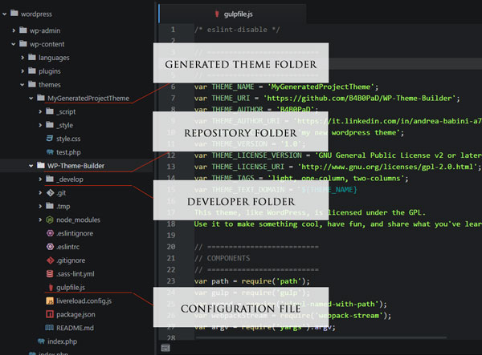
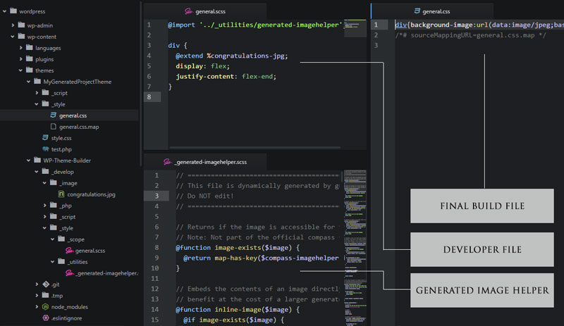
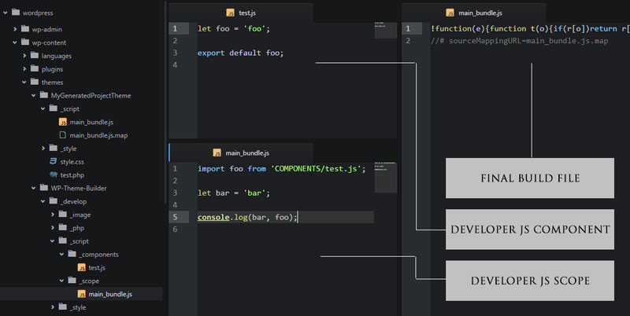
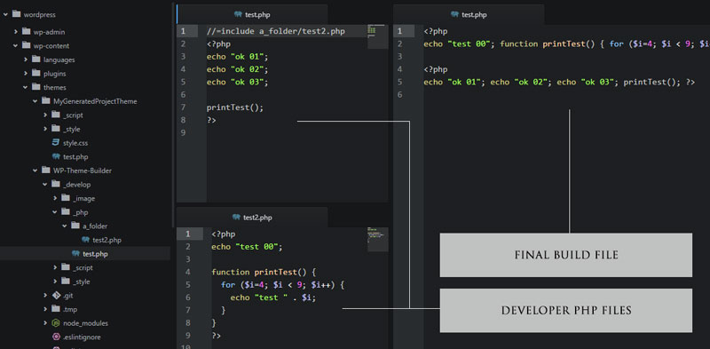

# WP Theme Builder

This boilerplate project is made to help wordpress developers in theme building.

1. Launch the node watch
2. Write your template code in the project folder
3. View your fully optimized generated theme!

=======================================================

###Build languages (compiler)
- Ecmascript 6 (**[Webpack](https://webpack.github.io/)** + **[Babel](https://babeljs.io/)**)
- SCSS (**[node-sass](https://github.com/sass/node-sass)** + **[CSSNano](http://cssnano.co/)**)
- PHP (**[Node](https://nodejs.org/)**)

=======================================================

###Style Features
- Autoprefixer
- Automatic image handler SCSS file generator
- Incremental build for nested files
- CSS File Minification
- All [CSSNano](http://cssnano.co/optimisations/) feaures (except [z-index](http://cssnano.co/optimisations/zindex/) automatic handler)
- Sourcemaps

###Script Features
- Import files
- All ES6 features ([view](http://es6-features.org/))
- Incremental build for nested files
- JS File Minification
- Sourcemaps

###PHP Features
- Include optimization
- PHP File minification

###Other Features
- OS notify handler for built files
- SASS and JS Linters
- [Livereload](https://www.npmjs.com/package/livereload) server with CSS destination folder target

##Quick guide

####Installation
- Download the project in the WP theme folder
- Access the project folder and do "npm install"
- Open gulpfile.js and edit your WP theme informations
- Run "npm run build"

After this step, the theme folder will be created next to the project folder, named correctly, with the template file _style.css_ inside.



####Commands
From terminal write:
- "**npm run build**" for a _single build_
- "**npm run watch**" to _incremental build_
- "**npm run lint**" to _check_ your scss and js file

##How to
All your code should be written in the "**\_develop/**" folder.

####Write style
All code written in the "_wp-content/themes/**\_develop/\_style/\_scope/**_" folder will be build to "_wp-content/themes/**THEME_NAME/\_style/**_" destination folder



####Write script
All code written in the "_wp-content/themes/**\_develop/\_script/\_scope/**_" folder will be build to "_wp-content/themes/**THEME_NAME/\_script/**_" destination folder



####Write template structure
All code written in the "_wp-content/themes/**\_develop/\_php/**_" folder will be build to "_wp-content/themes/**THEME_NAME/**_" destination folder

- Write PHP code in the _\_php_ folder as you are in your root theme folder
- Include PHP files outside `<?php ... ?>` tags with "**//=include RELATIVE_PATH/FILE.PHP**" format.

See this example:
```php
//=include a_folder/test2.php
<?php
echo "ok 01";
echo "ok 02";
echo "ok 03";

printTest();
?>
```
**REMEMBER**: Only the **FIRST LEVEL** files of _\_php_ folder will be move to the destination folder.

The generated final code will be:
```php
<?php
echo "test 00"; function printTest() { for ($i=4; $i < 9; $i++) { echo "test " . $i; } } ?>

<?php
echo "ok 01"; echo "ok 02"; echo "ok 03"; printTest(); ?>
```

